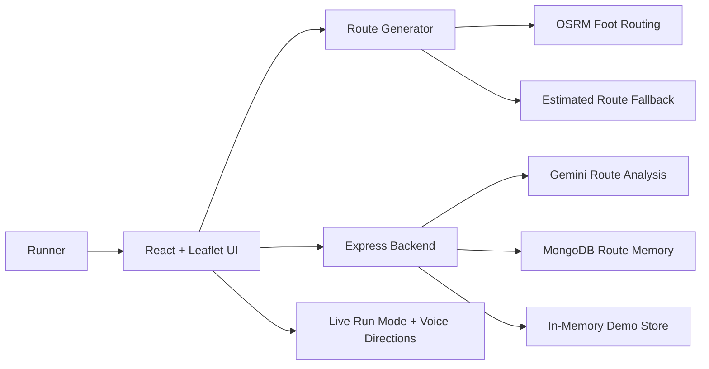

# RunRoute AI

An adaptive AI navigation agent for endurance runners.

RunRoute AI helps runners plan long-distance routes without repeating boring loops. A runner enters a start location, target distance, pace, route style, and training goal, then the app generates three nearby route options, shows them on a street map, compares safety and difficulty, and uses AI route analysis to recommend the best choice.

The project is built as a hackathon-ready full-stack MVP with a React map interface, an Express backend, Gemini route analysis, MongoDB-ready route memory, live run guidance, voice directions, and local activity recording.

## Links

| Item | Link |
| --- | --- |
| Public repo | Add your GitHub repository URL |
| Live app | Add your hosted frontend URL |
| Backend API | Add your hosted backend URL |
| Demo video | Add your demo video URL |
| License | MIT |
| Hackathon track | MongoDB |

## Highlights

- Generate 3 route options: Alpha, Pulse, and Horizon
- Target-distance accuracy with a +/- 2.5% acceptable range
- Street/path-snapped route lines through OSRM when available
- Fast fallback to estimated routes when the routing service is slow or unavailable
- RunRoute AI Recommendation panel powered by the backend Gemini endpoint
- Elite route intelligence matrix with safety, hydration, scenic, ease, risk, and tradeoff scoring
- Adaptive training memory coach with next-run target, ramp percentage, learned signals, and agent actions
- Safety, difficulty, hydration, elevation, and training analysis
- Save route memory locally and through MongoDB-ready backend endpoints
- Adaptive "Plan My Next Run" recommendation from route history
- Live run mode with route-following guidance
- Browser voice directions for navigation prompts
- Local activity recording with elapsed time, distance, pace, and GPS track
- GPX and KML export
- Responsive dark futuristic interface with map-first layout

## Demo Flow

1. Enter a 20 km marathon training run.
2. Generate three route options: Alpha, Pulse, and Horizon.
3. Show the map with route lines, stops, distance, time, elevation, and safety.
4. Open the RunRoute AI Recommendation panel.
5. Show AI confidence, why the route is best, safety note, training note, and hydration advice.
6. Save a route to create route memory.
7. Click `Plan My Next Run`.
8. Show the adaptive recommendation, for example: "Based on your last 20 km run, your next long run should be 22 km with lower elevation and more hydration stops."
9. Open live run mode to show route following, voice directions, and activity recording.

## Tech Stack

| Layer | Technology |
| --- | --- |
| Frontend | React, Vite, Leaflet, OpenStreetMap tiles, lucide-react |
| Styling | Custom CSS, responsive grid layout, dark mode |
| Routing | OSRM foot routing with estimated fallback |
| Backend | Node.js, Express, CORS, dotenv |
| AI | Google Gemini via `@google/generative-ai` |
| Database | MongoDB driver with in-memory fallback for local demos |
| Export | GPX and KML file generation |

## Architecture



## Project Structure

```text
RunRoute/
  src/
    main.jsx          # React app, route generation, map, AI panel, run mode
    styles.css        # Full responsive UI styling
  server/
    index.js          # Express API, Gemini analysis, MongoDB memory endpoints
    .env.example      # Backend environment variable template
  README.md
  LICENSE
  package.json
```

## Getting Started

### 1. Install frontend dependencies

```bash
npm install
```

### 2. Install backend dependencies

```bash
cd server
npm install
cp .env.example .env
```

### 3. Configure backend environment

Edit `server/.env`:

```bash
GEMINI_API_KEY=your_gemini_key_here
MONGODB_URI=your_mongodb_uri_here
MONGODB_DB=runroute_ai
PORT=8787
CLIENT_ORIGIN=http://127.0.0.1:5173
```

Keep API keys and database credentials in `server/.env`. Do not put them in frontend code.

### 4. Start the backend

```bash
npm run dev
```

The backend runs at:

```text
http://127.0.0.1:8787
```

### 5. Start the frontend

Open a second terminal from the project root:

```bash
npm run dev
```

The frontend runs at:

```text
http://127.0.0.1:5173
```

## Quality Checks

Run the production build before submitting:

```bash
npm run build
```

Check backend syntax:

```bash
node --check server/index.js
```

Check installed backend dependencies:

```bash
npm --prefix server ls --depth=0
```

## Environment Variables

### Backend

| Variable | Required | Description |
| --- | --- | --- |
| `GEMINI_API_KEY` | Recommended | Enables live Gemini analysis. If missing, the backend returns a local fallback. |
| `MONGODB_URI` | Recommended | Enables MongoDB route memory. If missing, the backend uses in-memory demo storage. |
| `MONGODB_DB` | No | Database name. Defaults to `runroute_ai`. |
| `PORT` | No | Backend port. Defaults to `8787`. |
| `CLIENT_ORIGIN` | No | Allowed frontend origin for CORS. Defaults to `http://127.0.0.1:5173`. |

### Frontend

| Variable | Required | Description |
| --- | --- | --- |
| `VITE_AI_API_BASE_URL` | No | Backend URL for deployed environments. Defaults to `http://127.0.0.1:8787`. |

## API Reference

### Health Check

```http
GET /api/health
```

Returns backend status plus whether Gemini and MongoDB are configured.

### Analyze Routes

```http
POST /api/analyze-routes
```

Request:

```json
{
  "routes": [],
  "distance": 20,
  "pace": "7:00 /km",
  "trainingGoal": "Marathon prep",
  "routeStyle": "parks"
}
```

Response:

```json
{
  "source": "gemini",
  "analysis": {
    "bestRouteId": "route-id",
    "bestRouteName": "Alpha",
    "confidence": 92,
    "whyThisRoute": "Short reason",
    "safetyAnalysis": "Safety note",
    "difficultyAnalysis": "Difficulty note",
    "hydrationAdvice": "Hydration advice",
    "trainingRecommendation": "Training recommendation"
  }
}
```

### Save Generated Routes

```http
POST /api/routes/generated
```

Saves generated route batches, route preferences, training goal, and previous pace/distance.

### Save Selected Route

```http
POST /api/routes/save
```

Saves a selected route to route memory.

### Plan Next Run

```http
POST /api/agent/next-run
```

Returns an adaptive recommendation based on saved route history.

### Get Memory

```http
GET /api/memory/:userId
```

Returns saved route memory and preferences for debugging or demo checks.

## Core Features

### Route Generation

RunRoute AI creates three route options near the selected start location. It first builds estimated route geometry, then attempts to snap the route to OSRM walking paths. If OSRM is slow or unavailable, the app quickly returns to the estimated route preview instead of leaving the user stuck.

### AI Recommendation

The RunRoute AI Recommendation panel compares route options and shows:

- Best route
- AI confidence
- Why this route is best
- Safety analysis
- Training recommendation
- Hydration advice

### Adaptive Route Memory

The app saves:

- Generated routes
- Saved routes
- User preferences
- Training goal
- Previous pace and distance

When MongoDB is configured, this memory is stored in MongoDB. Without MongoDB, the backend uses an in-memory store so the demo still works locally.

The adaptive coach turns that memory into a next-run target, hydration spacing, terrain bias, progression percentage, and practical agent actions.

### Live Run Mode

Live run mode includes:

- Route-following screen
- Start, pause, resume, finish, and reset controls
- GPS track recording
- Route progress
- Off-route warning
- Browser voice directions
- Saved activity history

## Troubleshooting

| Issue | What to check |
| --- | --- |
| Gemini panel shows local fallback | Make sure `GEMINI_API_KEY` is set in `server/.env` and the backend is running. |
| MongoDB memory uses in-memory storage | Make sure `MONGODB_URI` is set in `server/.env`. |
| Frontend cannot reach backend | Confirm the backend is running on `http://127.0.0.1:8787` or set `VITE_AI_API_BASE_URL`. |
| Map shows estimated route preview | OSRM may be slow or unavailable; the app falls back quickly so planning still works. |
| Voice directions do not work | Use a browser that supports the Web Speech API. |

## Demo Video Plan

Keep the video under 3 minutes.

| Time | What to show |
| --- | --- |
| 0:00-0:25 | Problem: long-route planning is hard and repetitive |
| 0:25-1:05 | Enter a 20 km marathon training route |
| 1:05-1:40 | Generate Alpha, Pulse, and Horizon on the map |
| 1:40-2:10 | Show Gemini recommendation and route reasoning |
| 2:10-2:35 | Save route and click `Plan My Next Run` |
| 2:35-3:00 | Show live run mode, voice toggle, GPX/KML export |

## Portfolio Description

RunRoute AI is a full-stack endurance route planning app that generates personalized long-distance running routes based on user location, target distance, safety, elevation, hydration stops, and training goals. It integrates interactive maps, route scoring, AI recommendations, adaptive route memory, GPX/KML export, live route following, browser voice directions, and activity recording.

## Roadmap

- Add real user authentication
- Deploy frontend and backend
- Connect production MongoDB Atlas cluster
- Add Mapbox or OpenRouteService support for richer route data
- Add weather and air-quality API integration
- Improve turn-by-turn instruction generation
- Add Strava and Garmin export integrations
- Build a React Native mobile app

## Submission Checklist

- [ ] Public GitHub repository is available
- [ ] MIT license is visible
- [ ] README includes setup instructions
- [ ] Frontend is deployed
- [ ] Backend is deployed
- [ ] Gemini key is configured on the backend host
- [ ] MongoDB URI is configured on the backend host
- [ ] Demo video is under 3 minutes
- [ ] Devpost form is complete
- [ ] MongoDB track is selected

## License

This project is licensed under the MIT License. See `LICENSE` for details.
